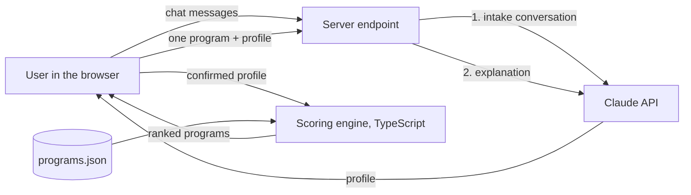

# Education Next-Step Advisor: 5-Day Build Plan and v1 Spec

Oct 6, 2026 · @Yami

> Update Oct 8: decisions refined during the Day 2 review (hours as a range, payment "no preference", the relocate and travel rule, PhD out of scope, program research in Perplexity) live in section 12 of `docs/implementation-plan.md`, which wins where the two differ. Tools and models are logged in `docs/tools-and-models.md`.

## Summary

v1 is an AI advisor conversation for a tech, product or engineering professional (8+ years, already holds a degree) who wants to grow as a leader: stepping up to a bigger leadership role, or leading better in the one they have. It works out what they actually need, decides which category of next step fits (full-time MBA, executive MBA, specialized master's, executive program, graduate certificate, short course, or no program yet), and backs the verdict with three scenario shortlists from 12 hand-verified programs. The conversation and the recommendation are the product and get most of the week. The website is a minimal page that hosts them, and how much UI gets added is the stretch goal.

The demo is two personas run live: one who ends with a hybrid EMBA because they need network density and a graduate degree for a VP move, and one who is told not to enroll yet because they cannot yet name the career goal a program would serve.

Decisions so far:

1. Program geography: **US only** to start; users can live anywhere (decided).
2. Intake style: **AI conversation with quick-reply chips** for numbers (budget, hours, on-site days) (recommended after research).
3. Model API key for the app's AI: **Claude**, paid if no partner credits apply (decided).
4. Program count: **12, two per type across six types, per the judges' 8 to 12 advice (decided)**.

Also: hosting decided by Thursday's first deploy; build locally in Docker until then, and Render's $50 challenge credits can pay for an instance that doesn't sleep; public repo for the portfolio and a recorded demo (decided).

## The magic moment

The magic moment is when the advisor tells the user something true about their decision that they had not put into words, then gives a verdict they can check. Every day's work is judged against it.

It has three beats:

1. **Reflect the real need.** After about 6 to 10 exchanges the advisor says, in the user's own terms, what they are really buying, for example: "You don't need more knowledge; you need a network in a product hub and a graduate degree your next employer will recognize."
2. **Name the tension.** It surfaces one contradiction or trade-off and lets the user choose, for example network first but no time on campus.
3. **Give a verdict across categories.** It recommends a category, possibly "not yet", explains why the others lost, and shows the programs as evidence with sources and confidence.

How quality is measured: 6 scripted test personas (including the two demo personas, one who should hear "not yet", and one who wants to grow in their current role rather than change it) are run through the conversation every day from Day 2. Each run is scored 1 to 5 on: did it find the real need, did it raise the right tension, is the verdict right, is every fact from the dataset, and does it feel like a sharp human advisor. The prompt and tools change until all six score 4 or better.

## Day 1 checkpoint (Oct 6)

The challenge asks Day 1 to end with a focused project brief, an honest record of the starting point, and a simple stack for the full build. All three are here, followed by check-in text ready to paste.

### Project brief

- **Who it helps:** tech, product and engineering professionals with 8+ years of experience and at least one degree, weighing an MBA, specialized master's, executive program, certificate or short course to grow as leaders: a bigger leadership role, or leading better in the one they have (for example, becoming a stronger people leader without changing roles).
- **Problem and outcome:** finding programs is easy; knowing which kind of next step, if any, is worth the money and time is not. In about 10 minutes they get a category verdict (including "not yet"), three scenario shortlists from verified programs, and the reasons.
- **Why AI:** it turns vague goals into specific needs, catches contradictions (wants a network but no time on campus) and explains trade-offs for this one person. Tuition, format and on-site time come from a hand-verified dataset, never from the model.
- **Simplest tools that test it:** one chat page, a Claude conversation that calls fixed scoring rules as tools, and one JSON file of verified programs.

### Starting point

Before Oct 6 only a written concept brief existed: target user, scope, won't-do list and risks. There was no code, repository, program data, design or prompt. Yami wrote the brief on Oct 5 to sign up for the challenge.

### Stack

Perplexity Pro to brainstorm and review outputs, Claude Max to plan and design, Claude Code to build the app, GitHub for the code, Docker for local runs, Render or Vercel for the public URL (chosen Thursday), and the Claude API with its key stored as `MODEL_API_KEY` on the server only. Details are under Tech stack below.

## Intake questions

The advisor collects these 17 fields in conversation, not a form. The table is its checklist: it does not recommend until every field is filled or the user declines one, and numbers (budget, hours, on-site days) are offered as quick-reply chips so scoring never depends on parsing free text. It asks open questions first (goal, what is missing) and constraints last.

| Step | Question | Field | Answer type |
| --- | --- | --- | --- |
| 1. Where you are | Years of experience | `yearsExperience` | number, gate at 8 |
| 1. Where you are | Highest degree and field | `degree` | select + text |
| 1. Where you are | Current role and level | `currentRole` | select (IC, manager, director, other) |
| 1. Where you are | Years leading people or teams | yearsLeading | number |
| 2. Where you want to go | Leadership goal: step up to a bigger leadership role, or lead better in the current one, and what that looks like | `careerGoal` | select + text |
| 2. Where you want to go | What is missing today: leadership skills, deep expertise in a field, a graduate degree, a senior network, access to a new industry or city | `needs` | rank top 3 |
| 2. Where you want to go | Who do you want as classmates: more senior leaders to learn from and open doors, peers at your level, or it doesn't matter? | peerPreference | select |
| 2. Where you want to go | Does the role you want require a graduate degree, or only prefer one? | `degreeRequired` | required / preferred / no / unsure |
| 3. Constraints | Tuition budget, and how you would pay it (savings, installments, employer support) | `tuitionBudgetUsd, paymentPlan` | range + select |
| 3. Constraints | Separate budget for travel and housing, if any | travelBudgetUsd | range or "not a concern" |
| 3. Constraints | How do you feel about traveling for the program: part of the appeal, fine, or a burden? | travelComfort | select |
| 3. Constraints | Hours per week available, and the longest program you'd take on right now (for example 8 weeks, a year, two years) | `hoursPerWeek`, `maxProgramMonths` | range + select |
| 3. Constraints | Can you stop working? | `keepWorking` | yes / no |
| 3. Constraints | Days per year you can be on site, and the longest single stretch you can be away (for example 3 separate weeks, not 3 weeks in a row) | `maxOnsiteDays`, maxStretchDays | range + number |
| 4. Location | Where you live and would you relocate | `homeCity`, `relocate` | text + yes / no |
| 4. Location | What should a location give you: network density, target industry hub, relocation path, immersion, affordability, travel ease, international exposure | `locationValues` | pick up to 2 |

Contradiction checks below are a starting set, not the full list. v1 codes them as fixed rules that run after step 4, and the AI raises each one in plain words before results. The advisor may also point out other tensions it notices, and any new one found in persona testing joins the coded set:

- Ranks network first but allows under 10 on-site days a year.
- Says a graduate degree is required but picks a budget only certificates fit.
- Wants a career switch to a new hub city but will not relocate or travel.
- Can give under 5 hours a week but asks for academic depth.
- Finds travel a burden but ranks network density or immersion first.
- Can be away only a week at a time but wants full academic immersion.

The user resolves each by choosing which side wins, and that choice is shown in the final explanation.

## Recommendation logic

The engine decides the category first, then filters programs on hard constraints, then ranks survivors three ways. All of it is plain TypeScript with fixed weights, so the same answers always give the same result and every number can be shown.

### Step 1: category fit

Step 1 picks the type of program before any specific program. It uses one intake answer, "What is missing today?", where the user ranks their top 3 of five needs: leadership skills, deep expertise in a field, a graduate degree, a senior network, and access to a new industry or city.

Each type is rated on how well it delivers each need: **Strong = 2, Some = 1, Little = 0**. The ratings describe the type in general; the example is one real program that shows what the type looks like.

| Type | What it is | Real example | Leadership skills | Deep expertise | Graduate degree | Senior network | New industry or city |
| --- | --- | --- | --- | --- | --- | --- | --- |
| Full-time MBA | General-management degree, about 2 years full-time, often used to switch industry or city | [Wharton MBA](https://mba.wharton.upenn.edu/class-profile): students average 5 years of work experience | Strong | Some | Strong | Little | Strong |
| Executive MBA (EMBA) | Same degree, about 2 years part-time, built for working leaders who keep their jobs | [Wharton MBA for Executives](https://executivemba.wharton.upenn.edu/class-profile/): students average 13 to 14 years of experience and keep working | Strong | Some | Strong | Strong | Some |
| Specialized master's | Degree in one field, such as engineering management; 1 to 2 years | [Northwestern MEM](https://mccormick.northwestern.edu/engineering-management/overview/student-body-profile.html): part-time students average 7.6 years of experience, full-time 5.3 | Some | Strong | Strong | Little | Some |
| Executive program | Non-degree university program for senior leaders, ends in a certificate; from about 8 weeks to a year | [MIT Technology Leadership Program](https://professional.mit.edu/course-catalog/technology-leadership-program): 8 months, campus immersions plus live online, professional certificate, aimed at C-level and senior tech leaders. Short end: [Yale SOM Women's Leadership Program, online](https://som.yale.edu/executive-education/for-individuals/leadership/womens-leadership-program-online), about 8 weeks | Strong | Some | Little (some give continuing-education credits, such as MIT TLP's 42 CEUs, which rarely count toward a degree) | Strong | Some |
| Graduate certificate | About 4 graduate-credit courses, usually online and part-time over about a year, that can count toward a master's later | [Harvard Extension graduate certificates](https://extension.harvard.edu/academics/graduate-certificates/), for example Strategic Management: 4 online courses | Some | Some | Some (credits can count toward one) | Little | Little |
| Short course | Hours to a few weeks on one concrete skill, from online platforms or workshops; no senior cohort and no academic credit. A real step, not the "no program" answer | [Coursera's AI For Everyone, an online course on AI for non-technical leaders](https://www.coursera.org/learn/ai-for-everyone) | Some | Some | Little | Little | Little |

Length is not a rating, because it doesn't measure fit: it is a limit the user sets, and it changes with the moment. Yami took two 8-week Yale programs in 2022 and 2024 because that was the most they'd commit to then, and in 2026 was open to MIT's 8-month program. All three were executive programs, so length can't define the type. The advisor asks for the longest program the user will take on now (`maxProgramMonths`), and Step 3 checks it against each program's own length, not the type's typical length. A type left with no program that short is ruled out. What separates a short course from a short executive program is who is in the room and what you leave with: a short course teaches one skill with no senior cohort; an 8-week executive program gives senior peers and a university certificate.

**How the score is counted.** The user's #1 need counts 3 times, #2 twice and #3 once. A type's score is the sum of its ratings on those three needs, each multiplied by its weight. The highest score wins and the runner-up is shown beside it.

**Then four plain adjustments:**

- No degree needed (from "Does your employer or target employer expect a degree?"): both MBAs and specialized master's lose 3. "Preferred" counts as not needed: for senior roles, experience plus an executive program like MIT TLP usually competes with an MBA, and the explanation says so. "Unsure" also counts as not needed, after the advisor lists the cases below so the user can check.
- Degree required: executive programs, graduate certificates and short courses are ruled out. A degree is truly required in only a few cases: consulting, investment banking and private equity recruiting; corporate MBA leadership-rotation programs; jobs with a formal education rule (some government, university and regulated roles); and postings that say "MBA required" rather than "preferred".
- Goal is growing in the current role: executive programs, graduate certificates and short courses gain 2. When a certificate and a short course tie, the advisor separates them by time and money: a short course when the skill is narrow and needed now.
- A type with no program inside the user's budget and time limits is ruled out.

A tie is not broken by formula: the advisor asks one question that separates the two types. "No program yet" is not on this table; Step 2 decides it.

**Worked example: Yami's decision in March.** Needs ranked: 1 senior network, 2 leadership skills, 3 deep expertise (emerging tech), no degree required (assumed), and nothing longer than about a year.

| Type | Senior network ×3 | Leadership ×2 | Expertise ×1 | Subtotal | Adjustment | Total |
| --- | --- | --- | --- | --- | --- | --- |
| Executive program | 6 | 4 | 1 | 11 | none | **11** |
| Executive MBA | 6 | 4 | 1 | 11 | 2 years, over the 1-year limit: ruled out | out |
| Full-time MBA | 0 | 4 | 1 | 5 | 2 years, over the 1-year limit: ruled out | out |
| Graduate certificate | 0 | 2 | 1 | 3 | none | 3 |
| Specialized master's | 0 | 2 | 2 | 4 | no degree needed, −3 | 1 |
| Short course | 0 | 2 | 1 | 3 | none | 3 |

Executive program wins, which is where MIT TLP sits. Two things decided it, as they did for Yami in March, and neither was the degree. Classmates' seniority: senior network is the top need, and full-time MBAs and specialized master's score low on it because their students average about 5 to 8 years of experience. Length: both MBAs take about 2 years, past Yami's limit. The EMBA has senior classmates too (13 to 14 years on average), so length is what ruled it out. Specific programs are then scored one by one in Step 4, so MIT TLP gets its own score there.

### Step 2: the no-program rule

The top result becomes "No program yet" when any of these hold, and the screen says which one:

- **No type fits well:** no type scores 4 or more in Step 1. Example: the only real need is a new city, and a job search there gets it faster than any program.
- **Nothing passes the constraints:** every program fails a hard constraint, near misses included. Example: a $3,000 budget, 2 hours a week and no travel.
- **The goal is unclear:** after two follow-ups the user still cannot name a career goal, so any spend is premature. Example: "Maybe management, maybe staying technical, I'm not sure yet."

A concrete skill gap is not a "not yet". When someone needs one specific skill and no degree, for example negotiation, giving feedback or AI strategy for leaders, a short course, such as an online course on AI, is a valid recommendation and has its own type in Step 1.

It still shows the best-fitting programs below it, labelled "if you decide to go anyway".

### Step 3: hard-constraint filter

A program passes only if tuition ≤ tuition budget, travel and housing ≤ travel budget when one is set, on-site days ≤ the user's limit, its longest single residency ≤ the longest stretch they can be away, program length ≤ the longest commitment they'll take on now, weekly hours ≤ availability, it is work-compatible when the user must keep working, and its location is reachable (home city, relocation allowed, or online/hybrid). Programs that fail by 15% or less stay visible as "near miss" with the failed check named.

### Step 4: scoring and the three scenarios

Each program carries five 1 to 5 ratings in the dataset: network, academic depth, practicality (format, flexibility, applied work), cost value, and location fit (computed from the user's two location values and travel comfort: travel they enjoy raises blended and on-site programs, travel they find a burden lowers them). A scenario is a weight set:

| Scenario | Network | Depth | Practicality | Cost value | Location fit |
| --- | --- | --- | --- | --- | --- |
| Best for network | 0.40 | 0.10 | 0.15 | 0.10 | 0.25 |
| Best for academic depth | 0.10 | 0.45 | 0.15 | 0.15 | 0.15 |
| Best for practicality | 0.10 | 0.10 | 0.45 | 0.25 | 0.10 |

These are the real weights the engine starts with, not examples. They are judgment calls rather than research, and each row adds up to 1. Every program that passes Step 3 gets one score per row: for example, its network rating × 0.40 + depth × 0.10 + practicality × 0.15 + cost value × 0.10 + location fit × 0.25 gives its "best for network" score. The weights get tuned against the six test personas on Days 2 to 4.

The score is the weighted sum, plus 0.5 if the program's category matches the winning category. Each scenario shows its top 3. The should-have "adjust priorities" slider just edits these weights and re-ranks on the client.

**Peer fit.** Classmates are often the main reason to enroll, so the engine compares the user's years of experience with the program's cohort median. If they want more senior classmates, a cohort below their experience loses 1 point and one at or above it gains 0.5. If they want peers at their level, a gap over 5 years either way loses 1 point. The card says it plainly, for example: "Most classmates have about 5 years of experience; you have 16." This is how a senior leader gets steered from a master's full of recent graduates toward an executive program.

### Confidence

High when the record was verified in the last 60 days with cost and on-site time from an official page and no near-miss checks; medium when one of those is missing; low otherwise. Confidence is shown on every card, never hidden.

## Program dataset

The dataset is one `programs.json` file in the repo, 12 records, every fact traceable to an official page with the date it was checked. The AI never fills or edits it.

### Schema

| Field | Type | Example or rule |
| --- | --- | --- |
| `id` | string | `wharton-emba-sf` |
| `name`, `institution` | string | as on the official page |
| `category` | enum | mba, emba, specialized\_masters, executive, certificate, short\_course |
| `credential` | string | "MBA", "MS Engineering Management", "Certificate of completion" |
| `format` | enum | in\_person, hybrid, online |
| `durationMonths` | number | total length |
| `credits` | string | what the program awards beyond the certificate, as on the official page: "none", "42 CEUs", "16 graduate credits"; shown on the card |
| `onsiteDaysPerYear` | number | total on-site days, counting residencies and weekend sessions; 0 for online |
| `residencyCount` | number | separate on-site trips per year, e.g. 3; 0 for online |
| `longestStretchDays` | number | days of the longest single trip, e.g. 7; checked against the longest the user can be away |
| `hoursPerWeek` | number | the school's own estimate, else marked estimated |
| `workCompatible` | boolean | designed for people working full time |
| `city`, `country` | string | primary site |
| `locationOffers` | enum\[\] | network\_density, industry\_hub, relocation\_path, immersion, affordability, travel\_ease, international |
| `tuitionUsd` | number or null | total program tuition; null if not published |
| `paymentOptions` | string\[\] \| null | as published: installments, employer sponsorship letter, federal or private loans, scholarships, early payment discount; null if the page doesn't say. Matched against the user's paymentPlan and shown on the card |
| `travelEstimateUsd` | number | own estimate, flagged as such. Computed, not searched: residencyCount × (the user's round-trip airfare + nights per trip × the city's GSA per diem lodging rate, with its date). The advisor asks for airfare only when a program needs travel, because it depends on where the user lives. The user picks a range on quick-reply chips (under $500, $500 to $1,000, $1,000 to $1,500, over $1,500); if they don't know, the card shows lodging only and says airfare is not included |
| `minExperienceYears` | number or null | from admissions page |
| `accreditation` | string\[\] | e.g. AACSB; empty for non-degree |
| `ratings` | object | network, depth, practicality, costValue, each 1 to 5, set by the rubric below |
| `ratingNotes` | string | one line per rating saying why |
| `sources` | {url, field, checkedOn}\[\] | one entry per fact group (tuition, schedule, class profile), with the date that page was checked |
| `verifiedOn` | date | computed, not typed: the oldest checkedOn among the sources, so the card shows how old the stalest fact is |
| `confidence` | enum | computed, not typed |
| `cohortMedianExperienceYears` | number or null | from the official class profile, e.g. 15; null if not published |
| `cohortSeniority` | string or null | from the official class profile, e.g. "mostly directors and VPs"; null if not published |

A zod schema validates the file in CI, so a record missing a source or date fails the build.

### Mix and seed candidates

Target 12 records across the six types, 2 each (the judges advised 8 to 12), spread across in-person, hybrid and online so the constraints actually bite. Candidates to pick the 12 from (US): Wharton, Kellogg, Berkeley Haas and Columbia EMBA or evening MBA options; MIT Sloan Fellows; Northwestern, Duke and Cornell engineering or technology management master's; Stanford LEAD; executive education leadership programs from Harvard, Stanford and MIT; and online graduate certificates in technology management or leadership from large public universities; and short courses on platforms such as Coursera or Udemy. Every candidate must be built around leadership: general-management degrees, technology or engineering management master's, leadership executive programs, leadership certificates, and short courses on a leadership skill. These are names to check, not verified facts.

### Verification process

1. Open the program's official page only; never take a number from a ranking or aggregator site.
2. Record tuition, format, duration, on-site days and how they are grouped, hours, minimum experience and the class profile (median experience, typical titles), each with its URL and today's date.
3. A fact the official page does not state stays null and lowers confidence; do not guess.
4. Rate the four ratings with the rubric: network = cohort size, alumni reach and in-person time; depth = credit hours and research or thesis content; practicality = schedule fit and applied projects; cost value = tuition against duration and credential.
5. A second pass on Day 4 re-opens 5 random records to spot-check.

The AI may help by drafting a record from a pasted page, but a human confirms every field before it is committed, and the commit message names who verified it.

## Output

The results page leads with the category verdict in one sentence, then the three scenario shortlists, then a side-by-side comparison of up to 3 programs the user pins.

The verdict block shows the winning category, the runner-up, the two needs that decided it, and any contradiction the user resolved. When the verdict is "No program yet", it names the trigger and suggests 2 or 3 concrete non-enrollment moves.

Each program card shows:

- Why it fits, and why it may not (two short lines each, written by the AI from the record and profile only).
- Constraint checks as pass, near miss or fail: budget, on-site days, longest stretch away, hours, work compatibility, location.
- Who your classmates would be: cohort experience and typical titles, with the peer-fit result.
- Credential type, format, duration.
- Tuition and payment options (installments, employer billing), shown apart from the travel and housing estimate, or "not published".
- On-site time per year.
- City and what that location gives this user, matched to their location values.
- Confidence level with the reason.
- Source links and the verified-on date.
- Three questions to ask admissions or alumni (should-have).

A footer on every results page states the dataset size, region, verification window and that it is not a complete list.

## Tech stack and architecture

One Next.js app, run in Docker locally and deployed to Render or Vercel, no database and no accounts; Claude is called at two points only, and the scoring engine never asks it for a decision.

The profile is the only thing that passes from the AI side to the engine, and the user confirms it before scoring. Confirming means the chat shows a short "Here's what I understood" card with the intake fields the AI filled in from the conversation (leadership goal, top 3 needs, budgets, hours, longest program, on-site limits, location, degree requirement), and the user taps "Looks right" or corrects any line. That way an AI misreading is caught before it changes the results. Explanations receive one program record and the profile, nothing else.

| Layer | Choice | Why |
| --- | --- | --- |
| Brainstorming | Perplexity Pro | Shaping the idea and the concept brief before the challenge, with cited web sources |
| Planning | Claude (a Claude project with this plan as a shared doc) | Turning the brief into this spec and schedule, with decisions made in doc comments |
| Build tool | Claude Code in the Claude desktop app | The challenge guide's route; plan first, then build in small committed steps |
| App | Next.js (App Router), TypeScript, Tailwind | One codebase for UI and the server endpoint |
| Code | GitHub | The host deploys from it on every push |
| Hosting | Local Docker now; Render (challenge credits) or Vercel, chosen by Thursday | The app runs as a plain Next.js Node server with a Dockerfile, so either host works unchanged. The only must: no sleep, so a judge never waits |
| Data | `programs.json` + zod schema | Reviewable in a diff; build fails on a missing source |
| Engine | Pure TypeScript functions + Vitest | Deterministic and unit-testable; runs on the client for instant re-ranking |
| AI | Claude Sonnet 5.5 via the Anthropic API, called only from the server endpoint | Key stored as `MODEL_API_KEY` in `.env` locally and as a host environment variable; never committed or shown in the page. Cost control: a monthly spend limit in the Anthropic Console, prompt caching, a per-visitor message limit on the public site, and unit tests that use a fake AI response so they cost nothing |
| State | URL parameters | Shareable results, nothing stored about the user |

Credit record: log each day's API spend in the worksheet; caching the two demo personas' explanations keeps judging traffic cheap.

### The advisor core, the website, and a later MCP server and Skill

The advisor core is the product: the data, the engine and the advisor rules that create the magic moment. The website is a thin shell around it, and an MCP server and Skill can wrap the same core after the challenge at little cost. They are not part of this week's stretch, which is UI.

- **What a Skill gives:** a packaged set of instructions Claude loads when needed. Here, the interview script, the contradiction rules, the no-program rule and the tone. It makes the conversation consistent without code.
- **What an MCP server gives:** tools Claude can call, here `search_programs`, `check_constraints` and `score_scenarios` over `programs.json`. Claude can then hold a free conversation and still pull facts only from the verified data.
- **The catch:** both run inside a Claude client (Claude Code, Claude desktop). A judge cannot open them from a link, and the challenge requires a public working URL. Users would also need a Claude account and setup steps, which works against the target user.

How they share one core:

- **Core** (`/core`, no web code inside): `programs.json`, the zod schema, the engine functions `searchPrograms`, `checkConstraints` and `scoreScenarios`, and `advisor.md`, the interview and reasoning rules. Most of the week goes here.
- **Website** (`/app`): the server endpoint calls the Claude API with the three engine functions as tools and `advisor.md` as the system prompt; the page is a chat plus result cards. This is the public URL judges use.
- **MCP server and Skill** (after the challenge): thin wrappers exposing the same functions and rules to Claude clients.

One rule keeps this cheap: the core never imports from the website. A fix to the data or scoring then reaches both surfaces at once.

## Day-by-day schedule

Dataset verification runs in parallel with the build every day, because it is the slowest and least compressible work. A working end-to-end flow exists by the end of Day 2 so Days 3 to 5 improve something that already runs.

| Day | Organizers' checkpoint | Advisor experience (the core) | Website and dataset | Check-in covers |
| --- | --- | --- | --- | --- |
| Tue Oct 6, Define and set up | Focused brief, starting point, simple stack | Decisions answered; draft `advisor.md` v0; write the 6 test personas (Yami's own March decision as persona A) | Tools ready: Claude Code, GitHub, Docker, Claude API key; agree the record fields and the 12 candidates | Brief, starting point, stack |
| Wed Oct 7, Build the core | One end-to-end AI result for a realistic input, rough UI fine; save an example; note the biggest gap | Engine functions with unit tests; Claude conversation calling them as tools; persona A runs from first message to verdict | Bare chat page on localhost; verify 4 programs | Persona A's transcript and verdict saved as the example; biggest gap named |
| Thu Oct 8, Integrate and develop | AI connected to the interface; only needed data; empty, unclear or failed input handled; another person tries it without instructions | Magic-moment day: tune the need reflection, the tension and the verdict; all 6 personas scored; recovery for empty, off-topic and failed AI replies | Chat page with chips and result cards (UI level 0) deployed to the chosen host; verify to 8; one person outside the project tries it cold | What the cold tester did and where they got stuck; persona scores |
| Fri Oct 9, Test, evaluate and deploy | Typical, difficult and refuse-or-escalate cases; check usefulness, clarity, privacy, accessibility, harm; fix the top issue; record limitations; reviewer URL works in a private window | Run the 7 tests below; fix the highest-impact failure; write the limitations list | UI stretch level 1 and up; verify the last 4 (12) and spot-check 3; private-window check of the public URL | The three cases and results, the fix made, the limitations, the live URL |
| Sat Oct 10, Finalize and submit | Polish the main journey; confirm URL and demo links; complete build summary, starting point, responsible build and limitation fields; submit before the deadline | Freeze the prompt; remove anything that distracts from the conversation | No new UI levels: recheck branding, usability and mobile across whatever levels shipped; two-minute recorded demo; README | Submission summary and links |

The UI is the stretch goal, climbed in this order as time allows:

1. **Level 0 (must ship):** one chat page with quick-reply chips; result cards showing the verdict, sources and confidence. Basic but professional: the Step Up name and wordmark, one accent color and font, a clean readable layout, mobile-friendly, and keyboard and screen-reader basics.
2. **Level 1:** a side panel showing what the advisor has understood about the user, editable.
3. **Level 2:** side-by-side comparison of 3 pinned programs.
4. **Level 3:** priority sliders that re-rank the scenarios live.
5. **Level 4:** richer visual polish beyond level 0's basic brand, such as illustrations, motion and design details.

Never cut: the "not yet" verdict, sources, confidence and the data-limits note.

## Tests

The challenge guide's six tests cover grounded answers, missing information, conflicting instructions and empty input; the Day 4 checkpoint adds a case the project should refuse or escalate. This app's seven tests:

1. **Grounded answer:** persona A's cards show only costs, formats and dates that match `programs.json`.
2. **Missing information:** a program with unpublished tuition shows "not published", and the explanation does not invent a figure.
3. **Conflicting instructions:** ranking network first with 0 on-site days triggers the contradiction prompt before results.
4. **Empty input:** submitting with optional fields and free text blank gives a friendly message, not an error.
5. **No program yet:** persona B, who still cannot name a career goal after two follow-ups, gets the "not yet" verdict.
6. **AI failure:** with the API unreachable, results still render from the engine with a plain fallback explanation.

7) **Refuse or escalate:** asked to predict admission chances, to advise someone outside the scope (no degree yet, a goal with no leadership side such as becoming a deeper individual expert, medicine or law), or for visa or legal advice, the advisor says it can't help with that, explains why, and points to who can (admissions offices, an immigration lawyer).

Day 4's three required cases map to tests 1 (typical), 3 (difficult) and 7 (refuse or escalate).

## How the plan meets the judging criteria

| Criterion | Weight | Where the plan earns it |
| --- | --- | --- |
| Problem and user value | 25% | One persona, a costly decision, and a verdict that can be "don't enroll yet" |
| Working execution | 25% | End-to-end flow live on Day 2; six tests; public URL retested in a private window |
| Thoughtful use of AI | 20% | AI interviews and explains; code decides; facts come only from verified data |
| Originality and approach | 15% | Decides between categories, not schools; location as career value; scenario shortlists |
| Responsible and inclusive design | 15% | Sources and dates on every card, confidence shown, data limits stated, no personal data stored, mobile-friendly |

## Privacy

Users describe their career, money and plans, so the app keeps as little as possible:

- No accounts and no database; the conversation lives in the browser tab and is gone when it closes.
- The server only passes messages to the model and never logs message content.
- Before the first message, the page says what is sent to the model provider and asks users not to share names, employers or contact details.
- To check before writing the responsible-build field: the model provider's current API data retention and training terms, quoted with a link.

## Final submission fields

Day 5 asks for four fields. Drafts start now and get updated as the build lands.

- **Build summary:** who it helps, the magic moment in one sentence, and what was built during the week (advisor rules, engine, dataset, website).
- **Starting point:** only the concept brief, written Oct 5 to sign up, existed before Oct 6.
- **Responsible build:** facts only from verified, sourced records; confidence shown on every card; the advisor can say "not yet"; no accounts and nothing stored about the user; out-of-scope requests declined and referred; chips have text labels and the chat works by keyboard.
- **Limitations:** 12 programs, US only, so not a complete list; ratings are an editorial rubric, not rankings; data is correct as of its verified date and may change; not admissions, financial or legal advice.

## Risks and fallbacks

| Risk | What it looks like | Fallback |
| --- | --- | --- |
| Verification runs slow | Fewer than 8 records by Thursday night | Ship with 8, the low end of the judges' range, and say so in the footer |
| Tuition not published | Many executive programs list price only on request | Keep null, show "not published", lower confidence; never estimate |
| AI invents facts in explanations | A card mentions a cost or ranking not in the record | Prompt receives only the record and profile; a check rejects any number in the text that is not in the record |
| Results feel like famous-school lists | Same 3 programs top every scenario | Tune weights with the two personas on Day 3; certificates and executive programs must surface for at least one |
| Rubric ratings look arbitrary | Judges question a "network 5" | Show `ratingNotes` on hover and publish the rubric in the README |
| Demo breaks live | API timeout during judging | Cache both personas' explanations; deterministic engine works without the AI |

Out of scope for v1, as the brief says: global coverage, crawling, admissions prediction, scholarship search, resume parsing and accounts.

## Follow-ups after the challenge

- Offer it free to everyone on a free or open model; the model call sits behind one small adapter so it can be swapped.
- Package the core as an MCP server and Skill for Claude users.
- Expand beyond US programs and English.
- Richer location profiles: expand the location tags into a city profile per program location, such as industry hubs, major conferences and events held during residency dates, and cost of a week's stay. This would come from a curated, dated city dataset first; a live web search with cited sources is the later option.
- Live airfare estimate: replace the airfare range chips with a fare lookup from the user's home city to each program city around the residency dates, shown as a dated estimate with its source.
- Beyond leadership: support goals with no leadership side, such as becoming a deeper technical expert (staff or principal engineer, a new specialty), with their own needs, program types and candidates.
